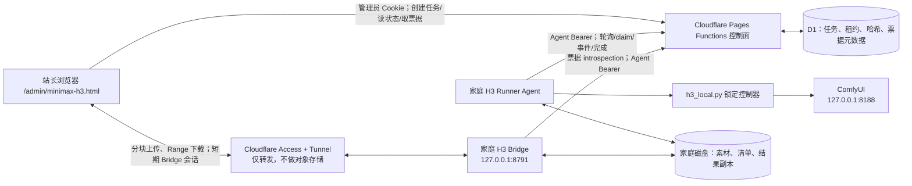
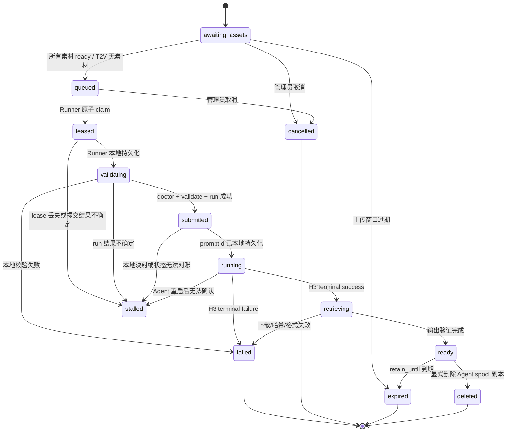

# MiniMax H3 本地 ComfyUI 远程任务与直传系统开发计划

> 文档版本：1.0
> 编写日期：2026-08-12
> 状态：**P0–P3 代码与本地回归已完成，Production D1 的 H3-only 增量迁移已完成；当前为隔离发布候选，执行链路仍默认关闭，Tunnel/Access、生产 token、GPU canary 与跨网络验收未完成**
> 适用仓库：`F:\lusu575个人站`
> 适用本机 H3 版本：`F:\AI视频H3\MiniMax-H3-Local\versions\2026-08-04_v4`
> 目标读者：站点维护者，以及上下文较小、推理能力有限、需要逐项执行的开发模型

## 0. 如何使用这份计划

这不是一份可以一次性全部交给模型并要求“全部完成”的需求说明。正确用法是：

1. 一次只实施一个阶段。
2. 每个阶段开始前重新读取本阶段列出的文件。
3. 只修改本阶段允许的文件，不顺手重构其他系统。
4. 完成本阶段的自动测试和人工验收后，才进入下一阶段。
5. 任何一项“停止条件”出现时立即停止，不猜测、不绕过、不用临时补丁伪装完成。
6. 所有生产 Dashboard、密钥、域名、Tunnel、Access 和发布操作由站长本人确认后执行。
7. 本文中的“推荐默认值”可以在实施前调整；一旦第一版协议落地，必须通过版本化迁移调整，不能静默改变。

本文优先保证：

- 不公开 ComfyUI。
- 不把参考素材和成片存进 Cloudflare R2、KV、D1 或 CDN 缓存。
- 不允许网站向家庭电脑下发任意工作流、命令或路径。
- 网络中断、重复请求、Agent 重启时不会无意重复执行昂贵的 GPU 任务。
- 低推理能力模型可以凭明确的输入、输出、禁止项和验收证据逐阶段开发。

## 1. 最终结论与固定技术路线

### 1.1 可以实现什么

当家庭电脑上的 Autumn／绘世启动器、ComfyUI、MiniMax H3 本地控制器、家庭 Agent 和 `cloudflared` 都处于可用状态时，站长可以在网站私有后台：

1. 创建受限的 MiniMax H3 视频任务。
2. 查看家庭执行器在线、就绪、忙碌和版本状态。
3. 将任务下发给家庭电脑。
4. 由家庭电脑调用现有锁定工作流执行 T2V、I2V 或 R2V。
5. 查看经过脱敏的阶段和进度。
6. 任务完成后，从家庭电脑直接流式下载成片到当前使用端。
7. 在允许的保留期内断点续传。
8. 显式删除 Agent 自己管理的本地副本。

### 1.2 首选架构

采用“两条平面”设计：

- **控制面**：现有 Cloudflare Pages Functions + D1。只保存任务、状态、租约、哈希、审计和短期传输票据等小型元数据。
- **数据面**：浏览器通过独立 Cloudflare Tunnel 访问家庭电脑上的窄功能 H3 Bridge。参考素材上传和成片下载都不经过 Pages Function、Worker 响应体、R2、KV 或 D1。

家庭 Agent 始终主动向外连接网站：

- Agent 通过 HTTPS 轮询和领取任务。
- `cloudflared` 主动建立出站 Tunnel。
- 家庭路由器不做端口转发。
- ComfyUI 仍只监听 `127.0.0.1:8188`。

### 1.3 “不使用 Cloudflare 存储”的准确含义

本方案承诺：

- 不为 H3 媒体创建或使用 R2 bucket。
- 不在 KV、D1、Durable Object 或 Pages 静态资源中写入媒体二进制。
- 不允许 H3 Bridge 的媒体响应进入 Cloudflare CDN 缓存。
- 不把整个文件先上传到 Cloudflare 再让用户下载。
- 媒体的持久副本只存在于上传端、家庭电脑和最终下载端。

本方案**不能**承诺：

- 视频字节完全不经过 Cloudflare 网络。
- Cloudflare 在网络转发过程中绝不进行任何瞬时内存缓冲。
- Tunnel 连接永不重连或永不中断。

使用 Cloudflare Tunnel 时，Cloudflare 是传输路径中的反向代理。正确表述必须始终是：**Cloudflare 转发字节，但本系统不使用 Cloudflare 持久对象存储，并显式绕过 CDN 缓存。**

如果未来要求“连流量都不经过 Cloudflare”，再单独实施本文第 28 节的 WebRTC／Tailscale 扩展；它不是 MVP 前置条件。

## 2. 不可违反的红线

以下任意一条被违反，都视为本项目验收失败：

1. 不得把 ComfyUI 完整前端嵌入网站或公开到公网。
2. 不得把 `127.0.0.1:8188`、`/prompt`、`/queue`、`/interrupt`、`/history`、`/view` 或 `/upload` 直接暴露给浏览器或 Tunnel。
3. 不得允许浏览器提交任意 ComfyUI workflow JSON、节点 ID、自定义节点安装请求或模型安装请求。
4. 不得允许网站向家庭电脑下发 Shell、PowerShell、Python 代码、可执行文件名、环境变量或任意本地路径。
5. 不得接受来自网站的 `path` 字段。远程引用只能使用服务端生成的不透明 `assetId`。
6. 不得接受 URL 作为 H3 本地参考素材；远程 URL 抓取不属于本项目。
7. 不得远程启动、停止、杀死或升级 Autumn／绘世、ComfyUI、GPU 驱动或 H3 模型。
8. 不得将管理员 Cookie 交给家庭 Agent，也不得让 Agent Bearer 获得通用管理员权限。
9. 不得把 Agent Bearer、Tunnel token、Access 凭据、票据 secret、Cookie、绝对路径、原始 Comfy 日志或代理配置写入云端日志。
10. 不得将参考素材、预览帧、成片或原始 Comfy 日志写入 D1、KV、R2 或 Durable Object。
11. 不得因为状态不确定而自动重新调用 H3 `run`；不确定的昂贵任务必须进入 `stalled` 并人工对账。
12. 不得把已经终止的任务原地改回等待状态；“重试”必须创建新的任务或新的明确 attempt。
13. 不得在收到下载连接关闭事件后立即删除本地结果；连接关闭不等于用户成功保存。
14. 不得用 `response.blob()` 读取整部成片后再下载，这会在浏览器内存中缓冲整个视频。
15. 不得把传输 secret 放入长期 URL、查询参数、浏览器历史、Referer 或普通访问日志。
16. 不得使用通配 CORS Origin 配合 credentials。
17. 不得把 Cloudflare Access 当成唯一业务授权；Bridge 仍必须验证网站签发的一次性传输票据。
18. 不得在本项目首版接入公开 remote MCP，也不得提前把未实现 transport 标记为 available。
19. 不得复用 Quick Transfer 的 R2、房间、口令、表、配额或对象生命周期。
20. 不得复用在线白板的 Durable Object namespace、房间密钥或协议。
21. 不得用 `innerHTML` 渲染 prompt、project title、文件名、任务事件、错误摘要或任何外部／用户可控字符串；统一使用 `textContent` 和 DOM API。

## 3. 当前可复用基线

### 3.1 站点侧

现有项目已经具备以下可复用能力：

- `/admin/*` 私有页面的管理员中间件。
- `/api/admin/*` 的 `requireAdmin` 角色检查。
- HttpOnly 账户会话。
- Agent 设备码授权、Bearer token、scope、过期和撤销机制。
- `operationId + canonical payload SHA-256` 幂等模式。
- 薄路由 + 独立 service 的 API 组织方式。
- D1 schema、运行时 guard、本地／远程迁移和回归测试框架。
- GitHub `main` 推送后由 Cloudflare Pages 自动部署的既有发布流程。

实施前必须重新查看：

- `AGENTS.md`
- `PROJECT_CONTEXT.md`
- `skills/lusu-personal-site-skill/SKILL.md`
- `CHANGELOG.md` 最新部分
- `admin/docs/ADMIN_PROJECT_CONTEXT.md`
- `admin/docs/ADMIN_SKILL.md`
- `admin/docs/ADMIN_CHANGELOG.md`
- `docs/agent-capabilities/README.md`
- `functions/admin/_middleware.js`
- `functions/api/agent-auth.mjs`
- `functions/api/agent-videos.mjs`
- `lib/capabilities/registry.mjs`
- `lib/capabilities/site-client.mjs`
- `cloudflare/schema.sql`
- `config/public-production-build.json`
- `scripts/build-production.mjs`

### 3.2 本机 H3 侧

现有 H3 控制器是唯一允许调用 ComfyUI 的策略包装层：

```text
F:\AI视频H3\MiniMax-H3-Local\versions\2026-08-04_v4\skills\minimax-h3-local\scripts\h3_local.py
```

控制器固定访问：

```text
127.0.0.1:8188
```

允许的控制器命令：

| 命令 | 远程系统用途 | 是否改变状态 |
|---|---|---:|
| `doctor [--job FILE]` | 启动前检查版本、锁定图、节点和 ComfyUI | 否 |
| `validate --job FILE` | 校验任务并生成审计 prepared copy | 仅写审计副本 |
| `upload --file MEDIA --kind ...` | 将已验证本地素材按内容哈希上传到 ComfyUI input | 是，幂等 |
| `run --job FILE --index N` | 提交一个受锁定任务 | 是 |
| `status PROMPT_ID` | 查询一个本地任务 | 否 |
| `cancel PROMPT_ID --confirm PROMPT_ID` | 精确取消待执行或确认中的当前任务 | 是 |
| `download PROMPT_ID` | 复制历史中明确返回的结果 | 是 |

控制器不会管理 ComfyUI 生命周期，并且每次操作都会核对 comfy-cli `1.12.0`。远程 Agent 必须调用控制器，不能自己重写 `/prompt`、`/queue`、`/view` 等 ComfyUI API。

第一版还必须固定并在每次真实提交前验证以下 SHA-256；任何一项变化都进入 `BLOCKED_SAFETY`，不得自动接受所谓“新版”：

| 文件 | SHA-256 |
|---|---|
| `skills/minimax-h3-local/scripts/h3_local.py` | `140C5A3E67A91BABD4FB10D0E72524B2F5E58F278DE4C068759AA50EA27FCC1B` |
| `skills/minimax-h3-local/references/job-schema.json` | `6E9DA0A36308241C4532D1D9CF29DFE9611D1ACBE8760D25D251953D9C6C89D7` |
| `skills/minimax-h3-local/references/workflow-lock.json` | `78A3F090097BBC0782AF834BA74F9EDACC6376E9B86E1DE2AD1CB08DF058C7ED` |
| `tools/discover-autumn-processes.py` | `6B7FB23107C2F19D15CAA28A6EE9BFD2AA4AE9496FF298AC0FE80603076A6D5C` |

这些 hash 只适用于本文顶部固定的 `2026-08-04_v4`。升级时必须走第 24 节版本升级流程，不能把新 hash 直接覆盖到配置后继续运行。

### 3.3 现有 H3 任务约束

- 模式：`t2v`、`i2v`、`r2v`。
- 默认任务时长：5 秒。
- 可变帧数：5–345，且 `target_frames % 17 == 5`。
- 显式 `target_frames` 时，`duration_seconds` 必须精确等于 `target_frames / 24`。
- 画幅：`16:9`、`9:16`、`1:1`。
- 默认 preset：`safe`。
- `safe`：官方 INT8，官方 0.4MP；16:9 为 864×480。
- `preview_fast` 只能由用户明确选择，只适用于 T2V 和单首帧 I2V。
- 首尾帧 I2V 和所有 R2V 必须使用 `safe`。
- R2V 最多 9 张图片、3 个视频、3 个音频，总引用最多 15。
- 多参考视频单个建议 2–15 秒，视频总时长不超过 15 秒。
- 参考角色变体和质量变体必须遵守控制器锁定规则，不能由远程端自由组合节点。

现有本地 job schema 允许额外字段，是为了本机扩展兼容。**远程 API 必须另建更严格的 schema，所有对象都使用 `additionalProperties: false`。**

## 4. 项目目标、非目标与分阶段范围

### 4.1 必须达到的目标

- 仅站长可访问的 H3 后台页面。
- 单台家庭执行器注册、心跳和就绪状态。
- 可靠、幂等的任务创建、领取、执行和完成状态机。
- 受白名单约束的 H3 参数。
- 参考素材从浏览器分块直传家庭电脑。
- 成片由家庭电脑按 HTTP Range 流式传给浏览器。
- 不使用 Cloudflare 媒体存储。
- 明确的离线、磁盘不足、Tunnel 中断、ComfyUI 未启动等失败状态。
- 完整审计，但审计内容不包含媒体、secret、本机路径或原始日志。
- 本机副本有保留期、手动删除和安全清理策略。

### 4.2 明确不做的事情

- 不为普通访客提供生成服务。
- 不做多人队列、计费、积分、套餐或第三方账户。
- 不把 ComfyUI 原版 UI 远程桌面化。
- 不允许任意工作流编辑器。
- 不从互联网自动下载参考素材。
- 不做云端 GPU 故障转移。
- 不保证家庭电脑离线时仍能下载历史成片。
- 不保证断电后尚未落盘的实时状态可以恢复。
- 不做自动模型下载、节点安装或驱动升级。
- MVP 不做 WebRTC、TURN 或 Tailscale 数据面。
- MVP 不做同时运行多个 H3 GPU 任务。

### 4.3 分阶段功能范围

| 阶段 | 功能 | 原因 |
|---|---|---|
| P0 | 契约、schema、测试骨架，无生产写入 | 先固定边界 |
| P1 | Runner 注册、心跳、控制台只读状态 | 验证安全控制面 |
| P2 | T2V 单任务闭环，无素材上传 | 最小可用、风险最低 |
| P3 | 成片直传下载、Range、无缓存 | 回答核心下载需求 |
| P4 | 单首帧／首尾帧 I2V 图片分块上传 | 先验证小素材 |
| P5 | R2V 图片、视频、音频分块上传 | 再开放大素材 |
| P6 | 安全取消、重试、清理和故障恢复 | 完善运维能力 |
| P7 | 生产加固与受控上线 | 最后开放生产 |
| P8 | 可选 WebRTC／Tailscale | 仅在不接受 CF 转发时 |

不得把 P0–P7 合并为一次超大修改。

## 5. 总体架构



### 5.1 控制面责任

控制面只能做：

- 管理员鉴权。
- Runner 授权、注册、撤销和心跳。
- 严格校验任务规格。
- 排队、条件 claim、租约和 revision。
- 保存脱敏事件和状态。
- 签发一次性上传／下载票据。
- 原子消费票据。
- 返回小型 JSON。

控制面绝不能做：

- 接收素材或成片请求体。
- 代理视频响应体。
- 保存视频分块。
- 接收本机绝对路径或 Comfy prompt ID。

### 5.2 家庭 Agent 责任

家庭 Agent 负责：

- 主动连接控制面。
- 维护单实例锁。
- 报告受限健康状态。
- 原子领取任务。
- 将远程严格任务转换为本地 H3 job plan。
- 调用固定版本控制器。
- 立刻持久化网站 job ID 与本地 prompt ID 的映射。
- 轮询 H3 状态并发送脱敏事件。
- 下载、验证、登记输出。
- 管理 Bridge、传输会话和本地保留期。
- 只删除自己拥有的 spool 文件。

### 5.3 H3 Bridge 责任

Bridge 是 Agent 的窄 HTTP 数据面，可以与 Agent 同一进程，但逻辑模块必须分离。它只提供：

- 健康探针。
- 一次性票据交换。
- 上传会话状态。
- 固定大小分块写入。
- 上传完成校验。
- 成片 HEAD。
- 成片单 Range GET。
- 会话注销。

它不提供目录列表、通用文件服务器、文件路径参数、ComfyUI 反向代理或任意 HTTP fetch。

## 6. 信任边界与威胁模型

### 6.1 信任主体

| 主体 | 身份 | 可以做什么 | 不能做什么 |
|---|---|---|---|
| 站长浏览器 | HttpOnly 管理员会话 | 管理任务、签发票据 | 获得 Agent token、本机路径 |
| 控制面 | Pages Function + D1 | 校验、排队、授权、审计 | 处理媒体字节 |
| 家庭 Agent | 专用 Agent Bearer + runnerId | claim、报告、校验票据 | 调用其他 admin API |
| Bridge | Agent 内部组件 | 对已授权 asset/result 传输 | 浏览任意磁盘路径 |
| cloudflared | Tunnel 凭据 | 把单一 hostname 转到 Bridge | 转发到 8188 |
| ComfyUI | 本机 loopback | 执行锁定图 | 直接接受公网请求 |

### 6.2 主要攻击与对应措施

| 风险 | 必须措施 |
|---|---|
| 未登录者访问 Bridge | Cloudflare Access 外层策略 + 应用层一次性票据 |
| 管理员页面被 CSRF | 精确 Origin、SameSite Cookie、CSRF header、JSON Content-Type |
| Agent token 被盗 | 专用非默认 admin-only scope、短权限、可撤销、永不记录 |
| 票据从 URL 泄露 | secret 只在 POST body 中交换，D1 只存 SHA-256 |
| 路径穿越 | URL 中只用固定格式 UUID；本地路径由 Agent 映射；拒绝 `..`、分隔符和编码绕过 |
| 任意工作流执行 | 服务端模板白名单 + 严格 schema + Agent 二次校验 + 本地控制器锁 |
| 重放导致重复 GPU 任务 | operationId 收据 + payload hash + 条件 claim + 本地 prompt 映射 |
| 两个 Agent 抢同一任务 | runner 绑定 + 原子条件 UPDATE + lease generation |
| 网络中断后误重跑 | 已提交但状态不确定时进入 stalled，禁止自动 run |
| 假 MIME／恶意素材 | magic/container probe、解码探测、尺寸/时长/codec 限制、最终哈希 |
| 下载旁路缓存 | no-store headers + Cloudflare Cache Rule Bypass + 线上检查 CF-Cache-Status |
| 磁盘被填满 | 预留空间检查、总配额、每任务限额、过期清理、低水位停接任务 |
| 日志泄密 | 字段 allowlist、错误码映射、secret/path/prompt 日志过滤 |

## 7. 第一版固定默认值

除非站长在 P0 明确修改，第一版按下表实现：

| 项目 | 默认值 | 说明 |
|---|---:|---|
| 后台入口 | `/admin/minimax-h3.html` | 不进入公开路由和 Dock |
| Bridge hostname | `h3-bridge.lusu575.com` | 实施时确认 DNS 可用性 |
| Bridge listen | `127.0.0.1:8791` | 只允许 loopback |
| ComfyUI listen | `127.0.0.1:8188` | 现状不变 |
| Runner 数量 | 1 | MVP 不做调度集群 |
| GPU 并发 | 1 | FIFO |
| job poll | 8 秒 + 0–2 秒 jitter | 失败指数退避至 60 秒 |
| heartbeat | 15 秒 | D1 持久化最多每 30 秒或状态变化 |
| offline 判定 | 60 秒无有效 heartbeat | UI 显示离线，不自动删除任务 |
| lease | 120 秒 | 每 30 秒续约；generation 防旧进程写入 |
| 上传 chunk | 8 MiB | 必须小于 16 MiB 的本地硬上限 |
| chunk 并发 | 2 | 避免家庭上行和磁盘压力 |
| ticket 有效期 | 5 分钟 | 一次交换后立即 consumed |
| Bridge session 空闲期 | 30 分钟 | 有活动时续期 |
| Bridge session 绝对期 | 12 小时 | 超时需重新签发票据 |
| 本地结果保留 | 24 小时 | 可在 1–168 小时内配置 |
| 未完成上传保留 | 6 小时 | 之后只清 Agent spool `.part` |
| job prompt 保留 | terminal 后 7 天 | 到期清除正文，仅留 hash/摘要状态 |
| job 元数据保留 | 90 天 | 小型记录 |
| 幂等收据保留 | 180 天 | 与站点既有模式一致 |
| 事件上报 | 阶段变化立即；进度最多 10 秒一次 | 避免写放大 |
| preset | `safe` | `preview_fast` 必须明确选择 |
| MVP 模式 | `t2v` | P4 后开放 i2v，P5 后开放 r2v |

这些值是本系统的配置常量，不得散落成魔法数字。应有一个版本化的 `protocol-config.mjs` 和一个不含 secret 的本地 `config.example.json`。

本地媒体安全限额第一版固定为：

| 项目 | 默认硬上限 |
|---|---:|
| JSON request body | 64 KiB |
| 排队 job | 10 |
| 单 job shot | 1；批量由控制面逐项创建 |
| 单 shot reference | 15 |
| 单 job asset 声明 | 30 |
| 单图片 | 50 MiB，另有解码像素上限 |
| 单音频 | 200 MiB |
| 单视频 | 1 GiB |
| 单 job 全部输入 | 2 GiB |
| 单结果文件 | 4 GiB |
| 单 job 全部结果 | 8 GiB |
| 同时上传 | 2 |
| 同时下载 | 4 |
| 新任务最低可用磁盘 | 50 GiB，实施前按实际磁盘确认 |

这是应用安全上限，不是对 H3 能力、浏览器或 Cloudflare 套餐的承诺。任何提高都必须同步威胁分析、内存/磁盘/限速测试和文档。

## 8. 建议文件结构与仓库治理

### 8.1 站点建议新增文件

```text
admin/
  minimax-h3.html
  minimax-h3.css
  minimax-h3.js

functions/api/
  minimax-h3-admin.mjs
  minimax-h3-agent.mjs
  minimax-h3-service.mjs
  minimax-h3-schemas.mjs

lib/minimax-h3/
  protocol-config.mjs
  canonicalize.mjs
  states.mjs
  error-codes.mjs

agents/minimax-h3-runner/
  README.md
  package.json
  package-lock.json
  config.example.json
  src/
    main.mjs
    config.mjs
    single-instance-lock.mjs
    site-client.mjs
    runner-loop.mjs
    job-store.mjs
    controller-adapter.mjs
    bridge-server.mjs
    transfer-auth.mjs
    upload-store.mjs
    download-server.mjs
    media-probe.mjs
    cleanup.mjs
    safe-logger.mjs
  test/

test/
  minimax-h3-admin.test.mjs
  minimax-h3-agent.test.mjs
  minimax-h3-schema.test.mjs
  minimax-h3-build.test.mjs

docs/
  MINIMAX_H3_REMOTE_DEVELOPMENT_PLAN.md
```

### 8.2 模块边界

- `[[route]].js` 只做路由分派，不放大型状态机。
- 管理员路由、Agent 路由和共享 service 分开。
- 共享 schema 和状态转换不得复制到多个文件。
- 本地 Agent 不进入 Pages 生产 `dist`。
- 新 admin HTML／CSS／JS 必须加入生产构建白名单和完整性检查。
- Bridge 与 runner 可以同进程，但不能把任意本地文件服务方法暴露给路由层。

### 8.3 必须遵守的项目文档规则

每个实际开发阶段至少更新：

- 根 `CHANGELOG.md`。
- 涉及后台契约时更新 `admin/docs/ADMIN_CHANGELOG.md`。
- 后台长期事实变化时更新 `admin/docs/ADMIN_PROJECT_CONTEXT.md`。
- 形成长期维护规则时更新对应 Skill 和 README。

特别警告：如果实现触碰 `functions/api/agent-auth.mjs`、`lib/capabilities/registry.mjs` 或 `docs/transfer/project.json` 中声明的其他共享受管文件，必须先读取 `docs/transfer/AGENTS.md`，并将 Quick Transfer 独立版本**精确增加 `0.0.1`**，同步它的 `VERSION`、`project.json`、`CHANGELOG.md`、`README.md`、可见版本和维护文档。最后运行：

```powershell
npm.cmd run check:subprojects
```

私有 admin-only 功能不需要写公开 `site-updates`。只有实际修改公开 UI、公开交互或公开资产时，才按项目规则同步四处三语更新记录及缓存 query string。

## 9. 严格远程任务契约

### 9.1 管理员创建任务请求

推荐远程 API 只接受单个 H3 shot；批量脚本由前端逐项创建并显式排序，避免一个大请求产生部分提交。

```json
{
  "operationId": "019...uuidv7",
  "runnerId": "runner_...",
  "projectTitle": "我的短片",
  "sourceLanguage": "zh-CN",
  "job": {
    "mode": "t2v",
    "workflowVariant": null,
    "durationSeconds": 5,
    "targetFrames": null,
    "aspectRatio": "16:9",
    "preset": "safe",
    "prompt": "Final English audiovisual prompt",
    "references": [],
    "includeVideoAudio": true,
    "seed": null
  }
}
```

所有对象：

- `additionalProperties: false`。
- 字符串先验证类型和长度，再 canonicalize。
- 不静默裁剪 prompt。
- 不静默替换 preset、画幅、模式或 workflow variant。
- 不接受 `path`、`url`、`workflow`、`node`、`command`、`env`、`host` 或 `port`。

### 9.2 seed 表示

本地控制器允许 0–`18446744073709551615`。JavaScript Number 无法精确表示完整 uint64，因此远程契约必须使用：

- `null`；或
- 十进制字符串，例如 `"1234567890123456789"`。

字符串规则：

- 正则 `^(0|[1-9][0-9]{0,19})$`。
- 用 `BigInt` 验证不大于 uint64 最大值。
- canonical payload 中始终保留字符串。
- 写本地 Python job plan 时才转换为整数。

不得让 JSON Number 承载大 seed，也不得用浮点转换。

### 9.3 引用素材契约

远程引用格式：

```json
{
  "assetId": "asset_...",
  "role": "first_frame"
}
```

允许的 role：

- `first_frame`
- `last_frame`
- `ref_image`
- `ref_video`
- `ref_audio`
- `storyboard_grid`

控制面验证资产属于同一个 owner、job 草稿和 runner；Agent 再验证资产已在本地完成、哈希一致、角色匹配，最后才把 `assetId` 映射为自己 spool 中的绝对路径。

### 9.4 模式交叉规则

- `t2v`：references 必须为空。
- 单首帧 `i2v`：恰好一个 `first_frame`。
- 首尾帧 `i2v`：一个 `first_frame` + 一个 `last_frame`。
- `preview_fast`：只允许 t2v 或单首帧 i2v。
- `r2v`：至少一个有效 reference；遵守 9/3/3/15 数量上限。
- `character-06`、`character-07`、`quality-28`：严格复制本地控制器当前规则；未写测试前不开放到 UI。
- 默认 `durationSeconds=5` 且 `targetFrames=null`。
- 有 `targetFrames` 时，验证范围、模 17 规则和与 `durationSeconds` 的精确有理数关系；不得用宽松浮点 epsilon 掩盖错误。

### 9.5 canonical payload 与幂等

创建任务时：

1. 严格 schema 通过。
2. 按固定字段顺序 canonicalize；不包含服务端生成时间和随机 ID。
3. UTF-8 编码后计算 SHA-256。
4. 以 `(ownerUserId, operationId, action)` 查收据。
5. 无收据：在同一 D1 batch 创建 job、初始 event 和 receipt。
6. 同 operationId、同 action、同 hash：返回原响应，并标记 `duplicate: true`。
7. 同 operationId 但 hash 或 action 不同：HTTP 409 `OPERATION_ID_CONFLICT`。

客户端只有在网络结果不确定时，才可使用同一 operationId 和完全相同 payload 重试。

## 10. D1 数据模型

D1 只保存控制面小型数据。表名前缀统一使用 `minimax_h3_`。

### 10.1 `minimax_h3_runners`

必须字段：

- `runner_id`：不透明主键。
- `owner_user_id`：管理员账户。
- `installation_id_hash`：本机安装 ID 的哈希，不存硬件序列号。
- `label`：站长可读名称。
- `status`：`active`／`disabled`。
- `protocol_version`、`agent_version`、`controller_version`。
- `capabilities_json`：有长度上限、服务器验证的能力摘要。
- `ready_state`：`offline`／`agent_only`／`bridge_only`／`comfy_unready`／`ready`／`busy`／`disk_low`／`error`。
- `busy_job_id`。
- `current_token_id`：最近有效 token，仅用于审计。
- `last_seen_at`、`last_persisted_heartbeat_at`。
- `revision`。
- `created_at`、`updated_at`。

Runner 不永久绑定一枚永不更换的 token。合法 token 轮换后仍可使用同一 runner；但每次 job lease 必须绑定领取它的 `token_id`，旧 token 不能继续写该 lease。

### 10.2 `minimax_h3_jobs`

必须字段：

- `job_id`、`owner_user_id`、`runner_id`。
- `operation_id`、`payload_sha256`。
- `protocol_version`、`template_version`。
- `spec_json`：严格验证后的受限任务；不含路径。
- `prompt_sha256`；prompt 正文仅在有限保留期内存在于 spec。
- `state`、`revision`、`attempt`。
- `lease_id_hash`、`lease_generation`、`lease_token_id`、`lease_expires_at`。
- `stage_code`、`progress_basis_points`。
- `error_code`、`error_summary`：仅脱敏值。
- `result_available`、`result_name`、`result_mime`、`result_bytes`、`result_sha256`。
- `retain_until`、`prompt_purge_after`。
- `created_at`、`queued_at`、`claimed_at`、`started_at`、`finished_at`、`updated_at`。

禁止字段：本机输出路径、Comfy prompt ID、原始 stderr、媒体 blob。

### 10.3 `minimax_h3_job_assets`

必须字段：

- `asset_id`、`job_id`、`owner_user_id`。
- `role`、`ordinal`。
- `display_name`：展示名，与磁盘名分离。
- `declared_mime`、`declared_bytes`。
- `verified_mime`、`verified_bytes`、`verified_sha256`。
- `upload_state`：`declared`／`uploading`／`verifying`／`ready`／`failed`／`expired`／`deleted`。
- `chunk_size`、`chunk_count`。
- `error_code`。
- `created_at`、`completed_at`、`updated_at`。

D1 不保存 chunk bitmap。chunk 收取状态只在家庭 Agent 本地保存；控制面只接收声明和最终完成摘要。

### 10.4 `minimax_h3_job_events`

追加式事件：

- `event_id`、`job_id`、严格递增 `seq`。
- `actor_type`：`admin`／`runner`／`system`。
- `actor_ref`：脱敏 ID。
- `event_type`。
- `from_state`、`to_state`。
- `code`、`summary`。
- `created_at`。

不允许更新或删除单个历史事件；按保留期批量清理整段旧记录。

### 10.5 `minimax_h3_operation_receipts`

唯一键：

```text
(actor_type, actor_ref, operation_id)
```

保存 action、payload hash、稳定响应 JSON 和创建时间。不得保存 token、Cookie 或媒体。

### 10.6 `minimax_h3_transfer_tickets`

必须字段：

- `ticket_id`。
- `owner_user_id`、`runner_id`、`job_id`、可空 `asset_id`。
- `direction`：`upload`／`download`／`preview`。
- `secret_sha256`：只存 hash。
- `allowed_methods_json`。
- `max_bytes`。
- `status`：`issued`／`consumed`／`revoked`／`expired`。
- `expires_at`、`consumed_at`、`created_at`。
- `consumed_by_token_id`。

消费票据必须是单条条件 UPDATE；只有 `issued` 且未过期的票据能成功一次。

### 10.7 索引与迁移要求

至少建立：

- jobs `(runner_id, state, created_at)`。
- jobs `(owner_user_id, created_at DESC)`。
- jobs `(lease_expires_at, state)`。
- assets `(job_id, ordinal)`。
- events `(job_id, seq)` unique。
- receipts unique 键。
- tickets `(runner_id, status, expires_at)`。
- runners `(owner_user_id, status)`。

实施时必须同步：

- `cloudflare/schema.sql`
- 本地迁移脚本
- 远程迁移脚本
- fresh install 测试
- existing install 测试
- schema/index guard

Production D1 复合 SELECT 继续遵守每组最多五项的项目既有约束。

## 11. 任务状态机与并发协议

### 11.1 状态图



### 11.2 合法迁移原则

- 状态迁移表只存在服务端共享模块中。
- 客户端只提交事件意图，不提交任意目标状态。
- 每次更新包含 `expectedRevision`。
- Runner 更新额外包含 `leaseId`、`leaseGeneration`、当前 token。
- UPDATE 的 WHERE 同时匹配 job、runner、revision、lease generation、未过期 lease 和允许的旧状态。
- `changes !== 1` 时返回 409，调用方重新读取，不盲目覆盖。
- terminal 状态不可逆。
- `retry` 创建新 job，并用 `retryOfJobId` 关联；不重置旧 job。

### 11.3 原子 claim

Runner claim 流程：

1. 检查 Agent scope、runner active、token owner 和 runner owner。
2. Runner 声明自己不忙且本地单实例锁有效。
3. 服务端选择最早的 `queued` job，且 runner 匹配。
4. 生成随机 `leaseId`，D1 只保存 hash。
5. 条件 UPDATE：`state='queued' AND revision=旧值`。
6. 同时将 `lease_generation + 1`、token ID、过期时间写入。
7. 同一 batch 写事件和幂等 receipt。
8. 只有一个请求能得到 job spec 和明文 leaseId。
9. 没有任务返回 204，不返回伪错误。

### 11.4 lease 丢失与昂贵任务防重

Agent 必须在本地持久化以下顺序：

1. 收到 lease。
2. 原子写入本地 job record 和 lease。
3. 执行 doctor/validate。
4. 调用 run。
5. 一旦得到 prompt ID，先 fsync 本地映射，再向网站报告 submitted。

以下情况禁止自动再次 `run`：

- `run` 请求已发出，但子进程退出结果不确定。
- Agent 在 `run` 后、持久化 prompt ID 前崩溃。
- lease 过期，但本地可能仍在运行。
- 网站更新超时，但不知道服务端是否提交成功。

这些情况统一：

- 停止新 claim。
- 将本地 job 标为 `needs_reconciliation`。
- 尝试只读 `jobs`／`status` 和本地审计记录对账。
- 能唯一确认 prompt ID 时恢复监控并向服务端 reconcile。
- 不能唯一确认时将云端标为 `stalled`，等待管理员明确处理。

### 11.5 取消规则

P2/P3 首版：

- `awaiting_assets`、`queued` 可以可靠取消。
- `leased` 但 Agent 尚未调用 run，可以通过 cancel command 停止。
- `submitted`／`running` 默认返回 `RUNNING_CANCEL_NOT_ENABLED`，不假装成功。

P6 只有在完成以下测试后才开放运行中取消：

- 本地 `cancel PROMPT_ID --confirm PROMPT_ID` 只删除精确 pending ID。
- 只有 `/queue` 确认同一 ID 是 current 时才调用 interrupt。
- 并发队列中不会中断另一任务。
- 重复 cancel 幂等。
- cancel 与自然完成竞态有确定结果。

当前固定版本控制器的运行中取消在确认 current ID 后仍会发送全局 `/interrupt`，目标恰好结束时存在误停下一任务的竞态。因此 P6 不仅要写外围测试，还应先把控制器改为 ComfyUI 支持的定向 `{"prompt_id": "..."}` 中断、更新固定 hash 和版本，再按 H3 升级流程重新验收。未完成前运行中取消必须保持关闭。

## 12. API 契约

所有 JSON API：

- 只接受 `application/json`。
- 流式限制请求体，不能先无界读取再检查长度。
- 对象拒绝额外字段。
- 返回稳定 `code`，不把异常堆栈发给客户端。
- 管理员 mutation 验证精确 Origin、CSRF 和 operationId。
- Agent mutation 验证 Bearer、scope、owner、runner、revision 和 lease。

### 12.1 管理员 API

| 方法与路径 | 作用 | 关键要求 |
|---|---|---|
| `GET /api/admin/minimax-h3/runners` | Runner 列表／状态 | admin Cookie；不返回 token/path |
| `GET /api/admin/minimax-h3/jobs` | 分页任务列表 | 固定 page size 上限 |
| `POST /api/admin/minimax-h3/jobs` | 创建任务 | 幂等；严格 schema |
| `GET /api/admin/minimax-h3/jobs/:jobId` | 详情和事件 | owner/admin；脱敏 |
| `POST /api/admin/minimax-h3/jobs/:jobId/cancel` | 请求取消 | operationId；状态限制 |
| `POST /api/admin/minimax-h3/jobs/:jobId/retry` | 创建新 attempt | 不能复活旧 job |
| `POST /api/admin/minimax-h3/jobs/:jobId/assets` | 声明一个素材 | P4 后开放 |
| `POST /api/admin/minimax-h3/jobs/:jobId/upload-ticket` | 签发上传票据 | asset 属于 job 且未 ready |
| `POST /api/admin/minimax-h3/jobs/:jobId/download-ticket` | 签发下载票据 | job ready；结果仍可用 |
| `POST /api/admin/minimax-h3/jobs/:jobId/preview-ticket` | 签发预览票据 | P3 后可选 |
| `POST /api/admin/minimax-h3/jobs/:jobId/delete-local-result` | 请求删除 Agent spool 副本 | 二次确认精确 jobId |

删除接口不能直接删除 ComfyUI 原始输出，只能发出 Agent command，删除 Agent 明确拥有的副本。

### 12.2 Agent API

| 方法与路径 | 作用 | 关键要求 |
|---|---|---|
| `POST /api/agent/minimax-h3/runners/register` | 注册／恢复 runner | 专用非默认 admin-only scope |
| `POST /api/agent/minimax-h3/runners/heartbeat` | 就绪状态和 lease 续期 | 字段 allowlist；有界写入 |
| `POST /api/agent/minimax-h3/jobs/claim` | 原子领取 | concurrency=1；204 表示无任务 |
| `POST /api/agent/minimax-h3/jobs/:id/events` | 追加阶段／进度 | lease/revision；频率限制 |
| `POST /api/agent/minimax-h3/jobs/:id/complete` | 登记输出摘要 | hash/bytes/mime；无路径 |
| `POST /api/agent/minimax-h3/jobs/:id/fail` | 登记脱敏失败 | allowlist error code |
| `POST /api/agent/minimax-h3/jobs/:id/reconcile` | 对账 stalled job | 仅合法恢复路径 |
| `POST /api/agent/minimax-h3/transfers/introspect` | 原子消费票据 | Agent Bearer；secret hash |
| `GET /api/agent/minimax-h3/commands` | 取消／清理命令 | 幂等 command receipt |

推荐只增加一个独立 scope：

```text
minimax-h3:execute
```

它必须：

- 非默认。
- `adminOnly`。
- 只允许上述 H3 Agent API。
- 不能访问文章、视频管理、Quick Transfer、账户或通用 admin API。

如果实施者选择拆成 claim/report/transfer 三个 scope，必须提供额外的 scope 组合测试；MVP 为降低复杂度推荐单一专用 scope。

### 12.3 Bridge HTTP API

| 方法与路径 | 作用 |
|---|---|
| `GET /v1/bootstrap` | 完成 Access 顶层登录并显示可关闭页面 |
| `GET /v1/health` | 最小公开健康状态 |
| `POST /v1/session/exchange` | 票据 secret 换 Bridge HttpOnly session |
| `DELETE /v1/session` | 注销 Bridge session |
| `GET /v1/uploads/:uploadId` | 返回本地 chunk 状态 |
| `PUT /v1/uploads/:uploadId/chunks/:index` | 写入一个固定 chunk |
| `POST /v1/uploads/:uploadId/complete` | 完整校验并原子完成 |
| `HEAD /v1/jobs/:jobId/result` | 返回下载元数据 |
| `GET /v1/jobs/:jobId/result` | 完整或单 Range 下载 |

最后一条 catch-all 必须返回 404；不能回退到静态目录。

## 13. 传输授权协议

### 13.1 为什么不用长效下载 URL

长效 capability URL 会进入：

- 浏览器历史。
- 下载管理器记录。
- Referer。
- 代理／Web 服务器 access log。
- 截图或复制链接。

因此默认使用“一次性 secret POST 交换 + Bridge HttpOnly Cookie”。

### 13.2 票据签发与交换

精确流程：

1. 站长已登录 `/admin/`。
2. Admin API 生成 256-bit 随机 secret 和 `ticketId`。
3. D1 只保存 `SHA-256(secret)`、方向、job/asset、方法、最大字节、5 分钟过期时间。
4. API 只在首次响应中返回 `{ticketId, secret, bridgeOrigin, expiresAt}`。
5. 页面先提示“连接家庭 Bridge”；顶层打开 `https://h3-bridge.lusu575.com/v1/bootstrap`，让 Cloudflare Access 完成身份认证。
6. 页面以 credentials 模式向 Bridge `POST /v1/session/exchange`，secret 位于 JSON body，不在 URL。
7. Bridge 校验精确 Origin、Content-Type、请求体上限和格式。
8. Bridge 使用自身 Agent Bearer 调用 introspection API。
9. 控制面原子比较 secret hash 并将 ticket 从 `issued` 改为 `consumed`。
10. Bridge 生成本地随机 session，绑定 direction、job、asset、方法、字节上限和过期时间。
11. Bridge 设置：

```text
Set-Cookie: __Host-h3_bridge_session=<opaque>; Path=/; Secure; HttpOnly; SameSite=Strict
```

12. 浏览器之后只访问干净 URL；secret 立即从 JS 内存变量清除，不写 localStorage/sessionStorage/IndexedDB。

### 13.3 CORS 与 CSRF

Bridge 只允许：

```text
Access-Control-Allow-Origin: https://lusu575.com
Access-Control-Allow-Credentials: true
Vary: Origin
```

本地开发 origin 必须在本机配置显式列出，生产配置中不得出现 localhost。

上传、complete、注销等 mutation 还需：

- 精确 `Origin`。
- session 内随机 CSRF 值。
- `X-H3-CSRF` header。
- 只允许列出的 method/header。
- 预检响应不泄露资源是否存在。

不得返回 `Access-Control-Allow-Origin: *`。

### 13.4 Access 只做外层防护

Cloudflare Access self-hosted application 必须限制为站长自己的身份，推荐启用 MFA。Access 成功不代表用户自动拥有某个 job 的下载权，因此 Bridge 仍需 ticket/session。

Tunnel 配置还应启用 origin-side Access JWT 校验（`originRequest.access.required` 与精确 application audience），让 `cloudflared` 在请求到达 Bridge 前再次验证 Access 身份。Tunnel ingress 最后一项必须是 `http_status:404`，不能有指向 ComfyUI 或其他本机服务的兜底。

本地管理 Tunnel 的示意配置如下；占位符只能由站长在本机 secret 配置中填写，不能提交真实 UUID、凭据路径或 audience：

```yaml
tunnel: <TUNNEL_UUID>
credentials-file: <LOCAL_CREDENTIAL_FILE>

ingress:
  - hostname: h3-bridge.lusu575.com
    service: http://127.0.0.1:8791
    originRequest:
      access:
        required: true
        teamName: <ACCESS_TEAM_NAME>
        audTag:
          - <ACCESS_APPLICATION_AUD>
  - service: http_status:404
```

若使用 Dashboard remotely-managed Tunnel，应达到同等效果并保存脱敏截图／导出证据，而不是照抄本地配置文件格式。

若 XHR 被 Access 重定向到登录页，UI 必须显示“先连接 Bridge”，通过顶层新窗口完成登录；不能关闭 Access 来绕过问题。

后台页面生产 CSP 必须把精确 Bridge origin 加入所需的 `connect-src`；只有实现站内 `<video>` 预览时才加入 `media-src`。不得用 `*` 或大范围域名放宽 CSP。

## 14. 参考素材分块直传

### 14.1 创建资产

浏览器先向 Admin API 声明：

- 原始展示文件名。
- role。
- 浏览器报告的 MIME。
- 字节数。
- 可选宽高／时长提示。

服务端生成 `assetId`；展示名只用于 UI，不参与磁盘路径。

### 14.2 分块协议

- chunk size 默认 8 MiB。
- 每个请求 `Content-Length` 必须存在并在允许范围内。
- URL index 必须是十进制无前导歧义。
- body 是原始 bytes，不使用 multipart/base64/JSON。
- header 使用 `Content-Range: bytes <start>-<end>/<total>`、`X-Chunk-SHA256: <64-lowercase-hex>` 和 `X-H3-CSRF`；URL index、range 和声明总长必须互相一致。
- 浏览器每块用 Web Crypto 单独计算 SHA-256；不把整个大文件读入内存。
- Bridge 用 exclusive create 或明确的同 hash 幂等覆盖规则写 `.part`。
- 同 index + 同长度 + 同 hash 重试返回原成功结果。
- 同 index + 不同内容返回 409 `CHUNK_CONFLICT`。
- 不支持乱序时必须明确拒绝；推荐支持最多两个并发块并用 bitmap 记录。
- chunk 状态只保存在家庭电脑。

Cloudflare Free／Pro 当前单请求体上限为 100 MB，但账户可调得更低。8 MiB 分块远低于该值，仍必须通过线上 413 测试，不得把 100 MB 当永远不变的协议常量。

### 14.3 完成校验

`POST complete` 必须依次完成：

1. 所有预期 chunk 存在。
2. 每块长度和 hash 一致。
3. 按顺序流式计算最终 SHA-256 和总字节数。
4. 文件 magic 与声明类型相符。
5. 使用受信任工具做真实解码／容器探测。
6. 验证图片像素、视频／音频时长、codec、轨道和各角色上限。
7. 检查 R2V 多视频总时长不超过 15 秒。
8. 在同一卷中原子 rename `.part` 到 opaque 最终名。
9. fsync manifest。
10. 向控制面报告 `verifiedMime/Bytes/Sha256`。

只有控制面确认 asset ready 后，job 才能从 `awaiting_assets` 进入 `queued`。

### 14.4 文件安全

- 磁盘名只能来自 `assetId` + 受信任扩展映射。
- 不使用用户文件名、role、prompt 或 project title 组成路径。
- 拒绝符号链接、junction、hardlink 输入和 reparse point。
- resolved path 必须仍在当前 job 的 asset root 内。
- 打开文件后再次核对 identity，降低 TOCTOU。
- 媒体探测子进程使用 argv 数组、`shell:false`、固定可执行文件和超时。
- 探测输出有最大长度，超限终止并返回稳定错误码。

### 14.5 分阶段素材限制

P4 只开放：

- PNG/JPEG/WebP 静态图片。
- `first_frame`／`last_frame`。
- 每张最大 50 MiB。
- 解码后像素总量必须有上限。

P5 再开放：

- `ref_image`／`storyboard_grid`。
- MP4/MOV 等明确 allowlist 视频容器和 codec。
- WAV/MP3/FLAC 等明确 allowlist 音频。
- 单资产和总 job 字节配额。

不允许模型在没有明确 allowlist 和探测测试时“顺便支持所有格式”。

## 15. 成片直传下载

### 15.1 下载路径

成片下载的 HTTP body 路径必须是：

```text
家庭磁盘 -> H3 Bridge -> cloudflared -> Cloudflare 网络代理 -> 使用端浏览器
```

不得经过：

```text
Pages Function body / Worker body / R2 / KV / D1 / Pages 静态文件
```

### 15.2 浏览器下载方式

MVP 推荐：

1. Admin 页面先完成 ticket exchange。
2. 用普通干净的 HTTPS 下载链接或受控隐藏 `<a>` 导航到结果 URL。
3. Bridge 返回 `Content-Disposition: attachment`。
4. 浏览器直接把网络流保存到下载目标。

不要使用：

```js
const blob = await response.blob();
```

它会把完整视频缓冲到浏览器内存。若将来需要精确前端进度和指定保存位置，可以用 File System Access API 的流式 writer，并为不支持的浏览器保留原生下载回退。

### 15.3 Range 要求

Bridge 必须支持：

- `HEAD`。
- 无 Range 的完整 `GET`，返回 200。
- 单一合法 byte range，返回 206。
- `bytes=N-`、`bytes=N-M`、`bytes=-N`。
- 不可满足或格式错误返回 416，并带 `Content-Range: bytes */<size>`。
- 多 Range 暂不支持，返回 416 或明确 400；不得错误拼接。
- `If-Range` 与强 ETag 匹配时返回 range；不匹配时回完整 200。

必须返回：

```text
Accept-Ranges: bytes
Content-Type: video/mp4
Content-Length: <exact>
Content-Range: bytes <start>-<end>/<total>   # 仅 206
ETag: "sha256-<verified hash>"
Content-Disposition: attachment; filename*=UTF-8''<encoded-safe-name>
```

下载使用经过验证的 manifest，不根据 URL、用户文件名或未经验证的扩展猜 MIME。

### 15.4 禁止缓存与转换的响应头

所有结果、预览和上传响应至少设置：

```text
Cache-Control: private, no-store, no-transform, max-age=0
Cloudflare-CDN-Cache-Control: no-store
Pragma: no-cache
Expires: 0
X-Content-Type-Options: nosniff
Referrer-Policy: no-referrer
Cross-Origin-Resource-Policy: same-site
Access-Control-Expose-Headers: Accept-Ranges, Content-Range, Content-Length, ETag, Content-Disposition
```

视频响应不做压缩，不设置公开缓存，不允许“Cache Everything”。

### 15.5 Cloudflare Cache Rule

在 hostname `h3-bridge.lusu575.com` 上创建高优先级规则：

```text
如果 hostname 等于 h3-bridge.lusu575.com
且 path 以 /v1/ 开头
则 Bypass cache
```

Cloudflare 对同一缓存设置采用规则顺序后的最终匹配结果。实施时必须在 Dashboard 的规则顺序中确认：不存在更靠后的规则把该 hostname 重新设为可缓存。若该 hostname 曾经启用缓存，应先按 hostname 清除旧缓存，并确认 Cache Reserve 未为该路径启用；不能只新增一条规则就假设历史副本已消失。

验收时连续两次完整 GET、两次 Range GET 和一次 HEAD：

- `CF-Cache-Status` 只能是 `DYNAMIC` 或 `BYPASS` 等不可缓存状态。
- 绝不能是 `HIT`、`STALE`、`REVALIDATED`。
- 不得出现 `Age` 递增。
- 第二次请求必须仍能在家庭 Bridge 访问日志中看到同一资源的读取事件。

Cloudflare 文档说明 Bypass 规则有时显示为 `DYNAMIC`，因此不能只要求文字必须是 BYPASS；核心是永不 HIT/STALE，并结合源站访问证据。

生产验收还应使用 Cloudflare Trace 或 Dashboard 规则调试确认 Bypass 规则真实命中，不能只依赖一个响应头推断配置正确。

### 15.6 中断与续传

Tunnel 或浏览器连接可能中断。客户端不得因此让 Agent复制或重新生成视频。恢复方式是：

- 在保留期内重新获取 ticket/session。
- 对同一已验证结果发送 Range。
- 用 ETag/总长度确认仍是同一文件。
- 下载完成后在使用端计算 SHA-256，可选与网站展示 hash 比对。

Cloudflare 对代理连接存在超时和重连限制，不能假设单条连接无限可靠。Range 是必备能力，不是优化项。

## 16. 家庭 Agent 详细设计

### 16.1 运行时选择

推荐：

- 本机已验证的 Node.js `26.1.0` 作为 Agent／Bridge HTTP 主进程；Agent package 单独固定并检查运行时，不改变站点构建的 Node 兼容下限。
- 固定 Python 解释器调用现有 `h3_local.py`。
- 子进程全部使用参数数组和 `shell:false`。
- 不依赖 ComfyUI Python 环境提供 Web 框架。

本地持久状态固定使用 SQLite，优先使用当前 Node 运行时自带的 `node:sqlite`，不自动安装第三方 native addon。本文编写时本机 `Node v26.1.0` 已确认可以加载 `node:sqlite`；正式安装仍必须把 Node 版本和以下 smoke test 纳入启动前检查：

```powershell
node --version
node -e "const { DatabaseSync } = require('node:sqlite'); const db = new DatabaseSync(':memory:'); db.exec('select 1'); db.close();"
```

若目标 Node 版本不能通过，不得悄悄切回 JSON 文件或安装未知 SQLite 包；应停止并由站长选择固定 Node 版本或单独评审替代实现。

SQLite 初始化必须执行并验证：

```sql
PRAGMA journal_mode = WAL;
PRAGMA synchronous = FULL;
PRAGMA foreign_keys = ON;
PRAGMA busy_timeout = 5000;
```

本地库至少包含 `jobs`、`assets`、`upload_sessions`、`upload_chunks`、`prompts`、`result_files`、`events`、`bridge_sessions`、`used_ticket_ids` 和 `schema_meta`。所有关键状态、调用 intent、prompt 映射和文件 ownership 都在事务中先落库，再执行下一项外部副作用。

### 16.2 配置

仓库只提交 `config.example.json`，真实配置放在 Git 忽略目录。至少包含：

- site API origin。
- runner label。
- H3 controller 固定路径。
- 固定 Python 路径。
- state root。
- bridge loopback host/port。
- 允许的 admin origin。
- 磁盘低水位。
- 各素材／输出大小限制。
- retention。
- 轮询、心跳和 lease 参数。

本文编写时本机已确认存在的执行路径如下，第一版配置应固定为这两个精确值，不使用 `current`、PATH 搜索或“最新版本”目录：

```text
pythonExecutable = F:\comfyUI\ComfyUI-aki-v3\python\python.exe
controllerScript = F:\AI视频H3\MiniMax-H3-Local\versions\2026-08-04_v4\skills\minimax-h3-local\scripts\h3_local.py
processDiscovery = F:\AI视频H3\MiniMax-H3-Local\versions\2026-08-04_v4\tools\discover-autumn-processes.py
```

不允许网站覆盖这些本地配置。

Agent credential 优先复用现有设备码和站点 credential store；在 Windows 上优先 DPAPI／Credential Manager。若退回文件：

- 文件不在仓库。
- 仅当前用户 ACL。
- 不显示在诊断输出。
- 不写入 crash dump 或普通日志。

### 16.3 单实例锁

Agent 启动时必须获得 state root 内的独占锁。锁记录实例随机 token、PID 和 heartbeat，但不能只凭 PID 判断所有权。

第二个实例：

- 如果现有锁仍活跃，明确退出 `AGENT_ALREADY_RUNNING`。
- 不杀死旧进程。
- 只有经过 stale lock 探测、owner token 检查和原子替换，才可恢复。

### 16.4 本地目录

推荐：

```text
<stateRoot>/
  runner/
    installation.json
    state.snapshot.json
    events.jsonl
  jobs/<jobId>/
    plan/site-request.json
    plan/local-job.json
    assets/<assetId>.part
    assets/<assetId>.<safe-ext>
    manifests/assets.json
    manifests/output.json
    result/result.mp4
    events.jsonl
  sessions/
  locks/
  quarantine/
```

所有目录名只来自服务器生成并本地严格验证的 opaque ID。

### 16.5 输出所有权

H3 `download` 会在 H3 版本输出目录生成独立、哈希和防碰撞的副本。Agent 不能把它当成自己可随意删除的文件。

推荐流程：

1. 控制器 download 完成。
2. Agent 验证返回 manifest 和实际文件。
3. Agent 在自己的 job spool 创建结果副本。
4. 同卷优先尝试 hardlink 前必须验证源为普通文件、非 reparse point；若任何条件不清楚，使用流式 copy。
5. copy 到临时文件，计算 SHA-256，fsync，原子 rename。
6. Agent 的自动清理只删除自己 spool 下的副本。
7. 控制器原输出和 ComfyUI 原始输出永不由普通 retention 清理。

如果站长以后需要清理 H3 原输出，另建明确工具和确认流程，不夹带在远程下载功能中。

### 16.6 每个任务的精确执行顺序

1. claim 后原子持久化 lease/job spec。
2. 验证四个固定安全文件的 SHA-256。
3. 验证 8188 只监听 `127.0.0.1`／`::1`，发现 `0.0.0.0`、`::` 或 LAN 地址立即 `BLOCKED_SAFETY`。
4. 调用固定 `discover-autumn-processes.py`，要求恰好一个允许的 launcher、一个 backend，并验证 backend 直接归 launcher 所有。
5. 再次严格验证 protocol version、模板、模式和本地资产 manifest。
6. 生成只含一个 shot 的本地 job plan，`schema_version: "1.0"`，将 assetId 映射为 spool 绝对路径。
7. 调用 `doctor --job <plan>`。
8. 调用 `validate --job <plan>`。
9. 调用 `run --job <plan> --index 1`。控制器的 index 从 1 开始，而且 `run` 会对 references 做受控内容哈希上传；Agent 不应预先重复调用独立 `upload`。
10. 捕获 JSON envelope；得到 prompt ID 后先持久化本地映射。
11. 报告 submitted。
12. 每 5 秒左右调用 `status <promptId>`，主进程继续 heartbeat/lease renew；正常流程不使用一个阻塞数小时的 `wait` 子进程。
13. terminal success 后调用 `download <promptId>`。
14. 只接受控制器 history 明确列出的输出。
15. 验证文件普通性、非 reparse point、MIME、大小、SHA-256 和视频可探测性。
16. 生成 Agent spool 副本和 output manifest。
17. 先提交本地 SQLite 事务并 fsync ready 状态，再向网站 complete。
18. 网站确认后开放 ticket 签发。

固定允许的控制器 argv 形状必须做快照测试。`--index`、命令名、controller path、Python path、plan path 位置不可由网络输入改变；prompt 和其他业务字段只能存在于已校验的 plan 文件内容中。

每个子进程：

- 固定 cwd。
- 固定 executable。
- 环境变量 allowlist；显式移除远程不可控的 `H3_COMFY_CLI` 覆盖。
- stdout/stderr 有界收集。
- 同时校验退出码、stdout JSON、`schema == "minimax-h3-local/1"` 和 `ok`；JSON 解析失败或 envelope 不符返回稳定错误。
- 路径在上传云端前被脱敏。
- doctor/validate/run-status/download 有独立超时和退出码处理。
- generation 允许长时间，但主 Agent 不阻塞心跳。

### 16.7 健康状态

Runner heartbeat 只上报：

- protocol/agent/controller version。
- `agentReady`。
- `bridgeReady`。
- `comfyReachable`。
- `controllerDoctorOk`。
- `busy` 和云端 job ID。
- `diskState`：ok/low/critical，不报绝对路径。
- 最近错误 code。

不得上报：PID、用户名、局域网 IP、磁盘绝对路径、模型路径、prompt ID、token 或原始错误。

### 16.8 启动方式

开发期：手动启动 Agent 和 cloudflared，便于看清故障。

稳定后可以：

- 将 cloudflared 安装为 Windows service。
- 将 Agent 配置为当前用户登录后启动或受限服务。

无论哪种方式：

- Agent 不自动启动 ComfyUI。
- Agent 不请求管理员权限，除非安装服务时由站长明确批准。
- Windows 防火墙不开放入站公网端口。
- Bridge 和 ComfyUI 都验证只绑定 loopback。

### 16.9 启动恢复顺序

Agent 每次启动必须按固定顺序恢复，不能先开始 claim：

1. 获取单实例锁。
2. 执行 SQLite `PRAGMA quick_check`；失败则 `BLOCKED_SAFETY`，不自动重建数据库。
3. 重新验证配置、固定文件 SHA、Python/controller 路径和 state root containment。
4. 只清理一小时前遗留、由数据库登记且仍位于 job spool 的 `.tmp-*`；正式 `.part` 保留供续传。
5. `assembling` 上传根据 chunk 表重新计算，缺块保持可恢复，不能发布半文件。
6. 对本地 `preflighting` 且从未写 submit intent 的任务，可以安全回到可执行队列。
7. 对 `submitting`：扫描固定 controller job record 目录，只接受 `job_file` 精确等于该 spool plan、`job_index=1`、创建时间位于本 attempt 之后的记录。
8. 恰好找到一个 prompt ID 时事务写回本地映射并继续 status；零个或多个都进入 `needs_reconciliation`，绝不重新 run。
9. `submitted/running` 只用已存 prompt ID 恢复 status 轮询。
10. `retrieving` 可以重新调用幂等 download 和结果验证，但不能重新生成。
11. 所有本地恢复完成并与网站 reconcile 后，才恢复 heartbeat ready 和新 claim。

每次外部副作用之前，先在 SQLite 写入唯一 `attemptId`、intent 和预期状态；每次外部结果之后，先提交本地事务，再报告云端。恢复测试必须在这些边界逐个强制终止进程。

## 17. 管理后台 UI 规格

### 17.1 页面组织

新增独立页面，不把逻辑继续塞入庞大的 `admin/admin.js`：

```text
/admin/minimax-h3.html
```

主后台导航新增“MiniMax H3”入口，但不进入公开主页、移动 Dock、Tools 或 Videos。

### 17.2 页面区域

1. **执行器状态**
   - 在线／离线。
   - Agent、controller protocol 版本。
   - ComfyUI 是否就绪。
   - Bridge／Tunnel 是否可连接。
   - 磁盘 ok/low/critical。
   - 当前忙碌任务。

2. **新建任务**
   - project title。
   - source language。
   - mode。
   - aspect ratio。
   - preset，默认 safe，并解释 preview_fast 限制。
   - prompt。
   - seed：空或十进制字符串。
   - 高级 target frames，默认隐藏。
   - reference asset 列表；未到对应阶段时禁用。

3. **素材上传**
   - 文件角色、名称、大小、验证状态。
   - chunk 进度和恢复。
   - 失败 code 与可执行的重新上传操作。

4. **任务队列**
   - FIFO 顺序。
   - waiting/queued/running/ready/failed/stalled。
   - 阶段、进度、更新时间。

5. **任务详情**
   - 只展示脱敏事件。
   - 输出 bytes/hash/保留截止时间。
   - 下载、重新获取 ticket、重试、删除本地副本。

6. **Bridge 连接**
   - “连接家庭 Bridge”按钮。
   - Access 登录说明。
   - 当前 session 状态。

### 17.3 UI 行为

- Runner 未 ready 时禁用提交，并准确说明缺失项。
- 离线不等于任务失败。
- 用户修改未提交表单后离开页面要提示脏状态。
- 创建按钮提交后立即禁用，网络不确定时复用同一 operationId，不生成第二个。
- 不通过轮询覆盖用户正在编辑的表单。
- 列表轮询使用可见页面低频刷新；隐藏标签页进一步降频。
- 错误显示稳定中文文案和可复制 code，不显示堆栈。
- 下载按钮在 ticket/session 准备好前不能生成长期 URL。
- 页面明确提示：“家庭电脑离线或本地结果过期后无法下载。”
- 页面明确提示：“Cloudflare 只作为传输代理，本功能不使用 R2 保存成片。”

### 17.4 可访问性与移动端

- 所有按钮最小 44px 可触区域。
- 表单有 label、错误关联和键盘焦点。
- 状态不只依赖颜色。
- 对话框支持 Escape、焦点圈和返回焦点。
- 删除本地结果需要输入或确认精确任务标识。
- 在 359×500、375×667、390×844、844×390 至少检查中文布局。
- 结果表格在窄屏改为卡片或可控横向滚动，不允许按钮重叠。

后台按项目约定只维护中文 UI，不擅自扩展公开三语系统。

## 18. 安全、隐私与日志

### 18.1 输入校验

必须双重校验：

- 控制面校验远程 schema。
- Agent 在本地执行前再次校验。

不能信任 D1 中“以前已经验证”的字段，也不能信任前端 disabled 控件。

### 18.2 日志 allowlist

允许记录：

- 时间。
- request/job/runner 的短 ID。
- event/error code。
- state transition。
- 字节数、耗时、HTTP 状态。
- SHA-256 可使用前 12 位用于定位，完整 hash 放 manifest/D1 专门字段。

禁止记录：

- Authorization/Cookie。
- ticket secret、CSRF secret、Tunnel token。
- prompt 全文和用户原始文件名，除非本地显式 debug 且默认关闭。
- 绝对路径、Windows 用户名、内网 IP。
- Comfy prompt ID 上云。
- SDP/ICE 等未来 P2P 网络信息。
- 原始子进程 stdout/stderr 上云。

### 18.3 错误脱敏

子进程错误先在本机映射为 code：

```text
CONTROLLER_DOCTOR_FAILED
JOB_SCHEMA_REJECTED
COMFY_UNREACHABLE
COMFY_BUSY
REFERENCE_UPLOAD_FAILED
H3_SUBMIT_UNCERTAIN
H3_RUNTIME_FAILED
OUTPUT_NOT_FOUND
OUTPUT_VERIFY_FAILED
DISK_LOW
TRANSFER_HASH_MISMATCH
TUNNEL_UNAVAILABLE
```

云端 summary 只能使用预定义安全模板。原始错误仅保留在家庭电脑受保护日志，并有保留期。

### 18.4 速率和配额

至少限制：

- 每管理员创建任务频率。
- 最大未完成 job 数。
- 每 runner claim 频率。
- heartbeat/event 频率。
- ticket 签发和 introspection 频率。
- Bridge session 数。
- 单 job asset 数和总字节。
- 未完成 `.part` 总空间。
- 结果总空间和磁盘低水位。

达到限制返回 429/409 和稳定 code；不得无限排队或静默丢弃。

## 19. 统一错误码

第一版至少定义以下错误码，并为 admin UI 提供中文解释和下一步：

| code | HTTP | 用户动作 |
|---|---:|---|
| `ADMIN_REQUIRED` | 401/403 | 重新登录管理员账户 |
| `ORIGIN_REJECTED` | 403 | 检查正式域名，不要关闭校验 |
| `SCOPE_REQUIRED` | 403 | 重新授权 H3 专用 Agent scope |
| `RUNNER_DISABLED` | 403 | 后台重新启用或重新注册 |
| `RUNNER_OFFLINE` | 409 | 启动家庭 Agent |
| `COMFY_UNREADY` | 409 | 手动启动绘世／ComfyUI 并等待 doctor |
| `DISK_LOW` | 409/507 | 清理本地空间 |
| `JOB_SCHEMA_REJECTED` | 400 | 修正字段；不自动改写 |
| `OPERATION_ID_CONFLICT` | 409 | 生成新 operationId 后重新执行新意图 |
| `REVISION_CONFLICT` | 409 | 重新读取最新状态 |
| `LEASE_LOST` | 409 | 停止写入并进入对账 |
| `JOB_STALLED` | 409 | 人工对账，不自动重跑 |
| `RUNNING_CANCEL_NOT_ENABLED` | 409 | 等待完成或进入 P6 功能 |
| `ASSET_NOT_READY` | 409 | 完成素材上传和验证 |
| `CHUNK_CONFLICT` | 409 | 重新创建 upload session |
| `ASSET_TYPE_REJECTED` | 415 | 使用 allowlist 格式 |
| `PAYLOAD_TOO_LARGE` | 413 | 检查 chunk/资产限制 |
| `TRANSFER_TICKET_EXPIRED` | 401/410 | 从后台重新签发 |
| `TRANSFER_TICKET_CONSUMED` | 409 | 从后台重新签发 |
| `BRIDGE_SESSION_EXPIRED` | 401 | 重新连接 Bridge |
| `RANGE_NOT_SATISFIABLE` | 416 | 重新读取 HEAD/ETag |
| `RESULT_EXPIRED` | 410 | 结果已不在 Agent spool；必要时人工查 H3 原输出 |
| `RESULT_HASH_MISMATCH` | 500 | 隔离文件，禁止下载 |
| `INTERNAL_ERROR` | 500 | 复制 request ID，不显示堆栈 |

## 20. 分阶段开发流程

### P0：契约、schema 和测试骨架

允许修改：

- 本文档及相关 context/changelog。
- 共享 H3 schema/state/error 模块。
- D1 schema 与迁移测试。
- API 测试骨架，但不开放真实路由。

任务：

- [ ] 固定 protocol version `1.0`。
- [ ] 写严格远程 JSON schema。
- [ ] 写交叉字段测试。
- [ ] 写 canonical payload 和 seed 测试。
- [ ] 写状态转换纯函数和表驱动测试。
- [ ] 添加六张 D1 表、索引和 schema guard。
- [ ] 写 fresh/existing migration 测试。
- [ ] 记录 Quick Transfer 受管文件影响并按规则升版（若触发）。

停止条件：

- 任何现有 D1 迁移测试失败。
- schema 需要接受 path/workflow/extra fields 才能通过。
- 实施者无法解释 seed 精度处理。

验收证据：测试输出、schema diff、迁移回读、`git diff --check`。

### P1：Runner 授权、注册、心跳和只读后台

允许修改：

- Agent auth 的最小 scope 配置。
- H3 agent/admin route/service。
- 最小 Runner 本地进程。
- admin 新页面的只读状态区。
- 构建 allowlist 和测试。

任务：

- [ ] 新增非默认 `minimax-h3:execute` scope。
- [ ] 验证只有管理员可批准。
- [ ] 实现 register/heartbeat。
- [ ] 实现本地设备码登录与 credential 安全存储。
- [ ] 实现单实例锁。
- [ ] 实现 controller doctor 健康检查。
- [ ] 后台显示 offline/ready/comfy_unready/disk_low。
- [ ] Agent Bearer 访问 `/api/admin/*` 必须失败。

验收：

- 无 token、普通用户 token、错误 scope、过期 token、撤销 token 全部被拒绝。
- token 轮换可恢复 runner，但旧 token 不能写新 lease。
- 停 Agent 60 秒后 UI 显示离线。
- 未启动 ComfyUI 时 UI 只显示未就绪，不尝试远程启动。
- 生产 build 包含 admin 页面但不包含本地 Agent 源码。

实现记录（2026-08-12）：`minimax-h3:execute` 已加入非默认 admin-only scope；固定版本 Runner 的 register/heartbeat、单实例锁、controller doctor、本地 config/token 边界和 admin 状态回读已实现。真实固定控制器 preflight、ComfyUI doctor 和临时 T2V validate 均通过；真实 Agent token 与生产服务安装仍未完成。

### P2：T2V 单任务闭环

任务：

- [ ] 实现管理员创建 T2V。
- [ ] 实现 operation receipt。
- [ ] 实现原子 claim 和 lease。
- [ ] 实现 Agent 本地 job store。
- [ ] 实现 controller adapter 的 doctor/validate/run/status/download。
- [ ] 实现事件、complete/fail。
- [ ] UI 显示队列、阶段和结果摘要。
- [ ] 关闭所有 reference 字段。

强制故障注入：

- 创建 API 响应丢失后重试同 operationId。
- 两个 claim 请求并发。
- Agent 在 claim 后重启。
- Agent 在 validate 后重启。
- 模拟 run 返回结果不确定。
- complete 响应丢失后重放。

验收：

- 同一创建意图永远只有一个 job。
- 同一 job 最多调用一次 run。
- 不确定 submit 进入 stalled，不自动重跑。
- 云端看不到 prompt ID 或路径。
- 真实 T2V 生成成功，输出 hash/bytes/mime 与本机一致。

实现记录（2026-08-12）：管理员 T2V 创建、operation receipt、原子 claim/lease、Runner spool、doctor/validate/run/status/download、事件/complete/fail 和 UI 结果摘要已实现。当前只开放无参考 T2V，控制开关默认关闭；本轮只完成本机 preflight/validate，未提交 GPU canary，因此“真实 T2V 生成成功”仍待站长明确验收。

### P3：Bridge、Tunnel 和成片直传

任务：

- [ ] 实现 Bridge loopback server。
- [ ] 实现 ticket 签发、introspection、原子消费和 HttpOnly session。
- [ ] 实现 Access bootstrap。
- [ ] 实现 HEAD、完整 GET、单 Range GET。
- [ ] 实现 no-store headers。
- [ ] 配置 Tunnel hostname，只指向 `127.0.0.1:8791`。
- [ ] 配置 Access self-hosted application。
- [ ] 配置 Cache Rule Bypass。
- [ ] admin 下载按钮使用原生流式下载，不用 blob。

验收：

- 未登录 Access 时无法交换票据。
- 登录 Access 但无业务 ticket 仍无法下载。
- ticket 只能消费一次，过期／跨 job／跨 direction 失败。
- 完整 GET 的 SHA-256 等于本地输出。
- 首段、中段、尾段 Range 字节逐字节等于本地文件。
- 中断后可从新 offset 续传。
- 两次请求均无 HIT/STALE，家庭 Bridge 都收到读取。
- 网站代码和 D1/R2 中不存在媒体字节。
- 家庭路由器无端口转发；8188 和 8791 均只绑定 loopback。

实现记录（2026-08-12）：loopback Bridge、一次性 download ticket/introspection、内存 HttpOnly session、Access bootstrap 占位、完整 GET/HEAD/单 Range、ETag 和 no-store/no-transform 已实现并通过本地回归；admin 下载动作使用原生流式导航，不把视频读入 Blob。H3-only Production D1 增量迁移已完成，生产代码仍须随 GitHub `main` 触发 Cloudflare Pages 后做 commit 回读；真实 `cloudflared` Tunnel、Access application、Cache Rule、生产 token、跨网络传输与 GPU canary 尚未完成，因此不能宣称生成链路已在线。

### P4：I2V 图片上传

任务：

- [ ] 实现 asset 声明。
- [ ] 实现上传 ticket/session。
- [ ] 实现 8 MiB chunk、hash、幂等重试和 resume。
- [ ] 实现图片 magic/解码/像素限制。
- [ ] 实现 `.part` 原子完成和 manifest。
- [ ] 开放单首帧和首尾帧 I2V。
- [ ] 对 preview_fast 交叉限制写测试。

验收：

- 0 字节、假 MIME、损坏图片、像素炸弹、超限文件被拒绝。
- 同 chunk 同 hash 重试成功，不同 hash 冲突。
- 上传中断后只补缺失块。
- 用户文件名无法影响本地路径。
- 浏览器/D1/日志看不到本机绝对路径。
- 两种 I2V 真机各成功一次。

### P5：R2V 大素材

任务：

- [ ] 固定视频／音频容器与 codec allowlist。
- [ ] 固定单资产、单 job 和 spool 总配额。
- [ ] 实现 ffprobe 等受限探测。
- [ ] 验证多视频总时长。
- [ ] 实现 9/3/3/15 引用规则。
- [ ] 分别测试 ref_image/ref_video/ref_audio/storyboard_grid。
- [ ] 只有完整测试后再开放 workflow variants。

验收：

- 伪装扩展、坏容器、超长视频、额外轨道异常、哈希错误均被拒绝。
- 2 GiB 级模拟文件的 chunk/resume 不要求浏览器整文件驻留内存。
- Bridge 内存稳定，不随文件大小线性增长。
- R2V 真机成功一次，且所有资产只存在使用端与家庭电脑。

### P6：取消、重试、清理和恢复

任务：

- [ ] 实现 command 队列和幂等 command receipt。
- [ ] 开放经过精确验证的 running cancel。
- [ ] retry 创建新 job/attempt。
- [ ] 实现本地 24h retention。
- [ ] 实现未完成上传 6h 清理。
- [ ] 实现 explicit local-result delete。
- [ ] 实现 stalled 对账工具和 UI。
- [ ] 实现磁盘低水位停接。

验收：

- 取消某 job 不影响队列其他 prompt。
- cancel 与自然完成竞态状态确定。
- 清理只触碰 Agent spool，不删除控制器/H3 原输出。
- 下载 socket 关闭不会立刻删文件。
- 结果过期后返回 410，UI 准确说明。
- Agent 在每个关键落盘点重启都能恢复或安全 stalled。

### P7：生产加固和上线

任务：

- [ ] 完整安全测试。
- [ ] 完整迁移、lint、test、build。
- [ ] 管理后台窄屏检查。
- [ ] Tunnel/Access/Cache Rule 人工复核。
- [ ] Windows 启动方式和凭据权限复核。
- [ ] 真实网络限速、中断和大文件续传。
- [ ] 先只对站长账户开放。
- [ ] 准备回滚和 token 轮换。

上线门禁：第 22 节所有 Gate 必须通过；任何一项缺证据都不得称为上线完成。

## 21. 测试计划

### 21.1 单元测试

- 严格 schema 和额外字段拒绝。
- uint64 seed 边界。
- duration/targetFrames 精确关系。
- 模式/preset/reference 交叉规则。
- canonical payload 稳定性。
- operationId 冲突。
- 状态迁移表。
- Range parser，包括 suffix/open-ended/invalid/multi-range。
- path/ID 校验。
- cookie/session/ticket 过期。
- 错误脱敏。
- 本地 manifest 原子写和恢复。

### 21.2 API 集成测试

- admin、非 admin、无 Cookie、Agent Bearer 访问 admin API。
- Agent 无 scope、错误 scope、撤销、过期。
- JSON MIME、Origin、CSRF、body limit、extra field。
- 并发 claim 只有一个赢家。
- 旧 revision/lease/generation/token 全部失败。
- 事件 seq、complete/fail 幂等。
- ticket 一次性、过期、跨 job、跨 direction。
- D1 batch 任一步失败时不留半条 job/receipt/event。

### 21.3 Bridge 测试

- 只监听 loopback。
- catch-all 404。
- 不存在目录 listing。
- CORS exact origin。
- CSRF。
- session fixation 和过期。
- chunk 重放、冲突、缺块、越界、负 offset。
- magic/decode/时长/配额。
- HEAD/GET/Range/If-Range/416。
- 读取中删除竞态。
- 慢客户端、连接中断和背压。
- 传输时内存不随文件线性增长。

### 21.4 真机 E2E

至少执行：

1. T2V safe 5 秒。
2. T2V preview_fast 明确选择。
3. 单首帧 I2V。
4. 首尾帧 I2V。
5. 最小 R2V 图像+视频或按实际工作流组合。
6. 完整下载。
7. 中断后 Range 续传。
8. Agent 离线／恢复。
9. ComfyUI 未启动／启动后恢复 ready。
10. Tunnel 停止／恢复。
11. 磁盘低水位。
12. token 撤销。

真实 GPU 测试费用高，必须记录任务 ID、版本、输入 hash、输出 hash 和结果；失败后不得为了“让测试变绿”自动重复 run。

### 21.5 安全测试

- 尝试提交 workflow JSON、path、URL、command、extra property。
- `../`、双编码、反斜杠、NTFS 特殊名、超长 ID。
- 假 Content-Length、chunked 超限、压缩炸弹、图片像素炸弹。
- ticket secret 重放、猜测和跨资源使用。
- Access 成功但无 admin ticket。
- 直接访问 Tunnel origin 的所有未声明路径。
- 8188 从局域网和公网不可达。
- 日志扫描 secret、路径、prompt ID 和 Authorization。
- Cloudflare cache 状态扫描。

### 21.6 项目级命令

每阶段根据实际脚本执行，最终至少包含：

```powershell
npm.cmd run test
npm.cmd run check:subprojects
npm.cmd run build
git diff --check
git diff --stat
git status -sb
```

不得只报告“应该能通过”；必须保存命令、退出码和关键输出。

## 22. 最终验收标准

### Gate A：访问与权限

- [ ] `/admin/minimax-h3.html` 对未登录和非管理员不可用。
- [ ] H3 scope 非默认且只能由管理员批准。
- [ ] Agent token 不能访问通用 admin API。
- [ ] Access 只允许站长身份。
- [ ] 票据一次性、短期、D1 只存 hash。
- [ ] 任何 URL、日志和浏览器存储中无 secret。

### Gate B：ComfyUI 隔离

- [ ] 8188 只绑定 loopback。
- [ ] Tunnel 只指向 8791。
- [ ] Bridge 无 ComfyUI proxy。
- [ ] 远程 schema 无 path/workflow/command。
- [ ] Agent 只调用固定 H3 控制器。
- [ ] 不存在远程 lifecycle 控制。

### Gate C：任务一致性

- [ ] 同 operationId 同 payload 重放同响应。
- [ ] 同 operationId 异 payload 409。
- [ ] 并发 claim 只有一个 lease。
- [ ] stale revision/lease/generation/token 被拒绝。
- [ ] 不确定提交进入 stalled。
- [ ] 任何 job 最多调用一次 run，除非管理员创建了新 retry job。

### Gate D：媒体不落 Cloudflare 存储

- [ ] H3 功能无 R2 binding/bucket。
- [ ] D1/KV/DO 无媒体 blob/chunk。
- [ ] Pages Function 不代理媒体 body。
- [ ] 上传直接到 Bridge。
- [ ] 下载直接来自 Bridge。
- [ ] Cache Rule Bypass 生效。
- [ ] 多次请求从不出现 HIT/STALE。

### Gate E：字节完整性

- [ ] 上传每块 hash 和最终 hash 通过。
- [ ] 文件真实类型/解码通过。
- [ ] 下载完整 SHA-256 与本地 manifest 一致。
- [ ] Range 起止和字节内容一致。
- [ ] 中断续传后最终 hash 一致。
- [ ] 不使用整文件浏览器 blob。

### Gate F：故障恢复

- [ ] Agent、ComfyUI、Tunnel 分别离线时 UI 准确。
- [ ] Agent 关键点重启可恢复或安全 stalled。
- [ ] 网络重试不重复 GPU 任务。
- [ ] 磁盘不足停止新任务。
- [ ] 过期和删除只影响 Agent spool。
- [ ] running cancel 未验证前不会假装支持。

### Gate G：项目质量

- [ ] 根和后台变更日志已更新。
- [ ] 若触发 Quick Transfer 受管文件，版本精确 +0.0.1 且检查通过。
- [ ] 新 admin 资产进入生产构建白名单。
- [ ] lint/test/build 通过。
- [ ] `git diff --check` 通过。
- [ ] 未覆盖工作区中其他用户改动。
- [ ] 发布后 `git status -sb` 干净，或明确列出发布前已存在的用户改动。

## 23. 部署顺序与回滚

### 23.1 正确部署顺序

1. 在本地 D1 和 mock Bridge 完成 P0–P3 测试。
2. 生成专用 Agent scope，但先不授权生产 token。
3. 部署向后兼容的 D1 schema。
4. 合并站点控制面和 admin UI，由 GitHub `main` 触发 Pages 部署。
5. 验证生产 API 仍默认拒绝／功能 flag 关闭。
6. 在家庭电脑安装 Agent，但不连接生产 claim。
7. 在 Cloudflare Dashboard 创建 Access application。
8. 创建 Tunnel 和 hostname，只指向 loopback Bridge。
9. 创建 Cache Rule Bypass。
10. 站长完成设备码授权 H3 scope。
11. 先启用 heartbeat，只读观察。
12. 启用单个 T2V canary。
13. 完成下载/no-cache/hash 验收。
14. 再逐阶段开放 I2V/R2V。

正常 Pages 发布仍走 GitHub `main`，不得把 `wrangler pages deploy` 当常规方式。

### 23.2 Feature flag

至少两个独立开关：

- `MINIMAX_H3_CONTROL_ENABLED`：允许创建/claim。
- `MINIMAX_H3_TRANSFER_ENABLED`：允许 ticket/introspection。

默认 false。关闭控制开关时：

- 已运行本地 job 不被强杀。
- Agent 停止 claim 新 job。
- 仍可在安全范围报告终态。

关闭 transfer 开关时：

- 不签发新 ticket。
- 已建立 session 可按明确策略完成或立即撤销；策略需在 P0 固定。

### 23.3 回滚

优先回滚：

1. 关闭 feature flag。
2. 撤销 H3 Agent token。
3. 禁用 Access application／Tunnel route。
4. 停止 Agent 和 cloudflared。
5. 回滚站点代码到上一已验证 commit。

D1 新表一般保留，不在紧急回滚时破坏性删除。删除 schema 另做备份和迁移，不使用 `DROP TABLE` 作为快速回滚。

## 24. 维护计划

### 每次使用前

- 确认家庭磁盘空间。
- 确认 Autumn／绘世只启动一个匹配后端。
- 确认 Agent ready、Bridge ready、Comfy doctor ok。
- 确认 Tunnel 和 Access 可用。
- 确认待处理队列中没有 stalled 未对账任务。

### 每周

- 查看失败率、stalled、票据异常和磁盘低水位。
- 抽查 Cache Status 不为 HIT/STALE。
- 抽查本地过期清理只在 Agent spool 内。
- 检查 Agent/cloudflared 进程无重复实例。
- 检查未完成 `.part` 是否按期清理。

### 每月

- 检查 cloudflared 和 Node/Python 安全更新；先 staging 验证后升级。
- 检查 H3 控制器版本、workflow lock/hash 和 comfy-cli 版本。
- 恢复演练一次 Agent 重启和 Tunnel 中断续传。
- 抽查 D1 retention 清理和 job/event/ticket 表增长。
- 审查 Access 成员和登录策略。
- 审查 Agent token 列表，撤销不用的 token。

### 每季度

- 轮换 Tunnel credential 和 Agent token；验证旧凭据立即失效。
- 完整跑一次权限、Range、no-cache、stalled 防重和磁盘故障演练。
- 审查媒体 allowlist、codec、探测工具和安全公告。
- 验证恢复文档与实际文件路径、版本、Dashboard 设置一致。

### 自动清理实现规则

- 每小时最多处理有界数量的到期记录，避免阻塞 Agent 主循环。
- 只从 SQLite ownership 记录逐文件选择目标。
- 每个文件删除前重新做 resolved-path containment、普通文件和非 reparse point 检查。
- 不对计算出的 job 目录直接执行递归删除。
- 文件逐个删除成功后，才删除数据库 file record；失败保留记录并重试有界次数。
- 最后只移除已确认为空、仍在 state root 内的目录。
- quarantine 默认 7 天；未完成上传默认 6 小时；结果默认 24 小时；元数据按 D1／本地各自保留期。
- 磁盘低水位只停止新 upload/claim，不删除运行中任务，不妨碍已有结果下载。
- 自动清理永不触碰 ComfyUI input、ComfyUI 原输出、控制器 prepared/job records、模型、节点、workflow 和版本目录。

注意：控制器会把参考素材以内容哈希名称放入 ComfyUI input，并保留自己的 output／审计副本。因此“Agent spool 已过期”不等于所有本机副本都已删除。MVP 为避免误删不自动处理这些目录；站长必须把它们纳入每月磁盘检查。以后若要自动清理，必须先在控制器层实现内容引用计数和明确 ownership，再作为独立项目验收。

### H3 本地版本升级时

1. 新版本先并行安装，不覆盖当前固定版本。
2. 读取新版本 skill、command reference、job schema、workflow lock。
3. 比较命令、JSON envelope、模式、preset、hash 和输出 manifest。
4. 更新 Agent adapter 的允许版本和 protocol capability。
5. 跑全套 doctor/validate/dry-run。
6. 跑至少一个 canary。
7. 成功后再切 config；旧版本保留回滚期。

不得让 Agent自动跟随“最新目录”。必须固定绝对版本，并显式升级。

## 25. 故障处置手册

### 25.1 Runner offline

检查顺序：

1. 家庭电脑是否开机、联网。
2. Agent 是否单实例运行。
3. token 是否过期／撤销。
4. site API 是否可达。
5. 本地安全日志的稳定 code。

禁止：自动创建第二个 runner、删除队列、重新提交运行中 job。

### 25.2 ComfyUI unready

1. 站长手动启动 Autumn／绘世。
2. 确认只存在一个匹配 backend。
3. 确认 8188 只在 loopback。
4. 运行 controller doctor。
5. ready 后 Agent 自动恢复 claim。

禁止由网站或 Agent kill/start 进程。

### 25.3 Tunnel／Bridge unavailable

1. 任务生成可继续，但暂不可上传/下载。
2. 检查 Bridge 本地 health。
3. 检查 cloudflared connector。
4. 检查 Access policy、DNS hostname、Tunnel route。
5. 恢复后重新签发 ticket，Range 续传。

禁止把结果临时上传 R2 作为“修复”。

### 25.4 job stalled

1. 禁止点普通“重试”。
2. 读取本地 job record 和控制器审计。
3. 用只读 `jobs`/`status` 寻找唯一 prompt 映射。
4. 唯一确认则 reconcile。
5. 无法唯一确认则等待现有 H3 队列稳定，再由站长明确创建 retry job。
6. 在事件中记录人工决定，不记录 prompt ID 上云。

### 25.5 hash mismatch

- 上传 mismatch：隔离 `.part`，资产 failed，重新建 upload session。
- 输出 mismatch：立即禁止 ticket，结果 quarantine，job failed 或 stalled，保留本机诊断证据。
- 下载端 mismatch：先重新 HEAD/ETag 和 Range；不能自动重新生成。

### 25.6 Cloudflare 出现 HIT／STALE

1. 立即关闭 transfer feature flag。
2. 检查 hostname/path Cache Rule 优先级。
3. 检查是否存在 Cache Everything、Worker cache API 或响应头改写。
4. 清除已有缓存对象（如存在）。
5. 重跑完整/Range 多次验证。
6. 未确认前不重新开放下载。

### 25.7 磁盘不足

1. Agent 停止 claim 和新 upload session。
2. 允许小型状态上报。
3. 按 retention 清理 Agent 自己的 expired spool。
4. 不删除 running job、控制器输出或 ComfyUI 原输出。
5. 站长人工清理后重新 doctor/health。

### 25.8 token／Tunnel credential 泄露

1. 立即撤销对应 token/credential。
2. 关闭 feature flag 和 Tunnel route。
3. 审计 runner、claim、ticket、Access 登录和下载事件。
4. 创建新 credential，更新受保护本机配置。
5. 验证旧 credential 失败。
6. 不在 issue、聊天、commit 或日志中粘贴泄露值。

## 26. 可观测性

需要的指标：

- runner online/ready 时间比例。
- queue depth 和最长等待时间。
- job 各阶段耗时。
- success/failed/stalled/cancelled 数量。
- claim conflict 和 revision conflict。
- ticket issued/consumed/expired/rejected。
- 上传/下载字节、耗时、中断、续传次数。
- hash mismatch。
- Bridge 4xx/5xx。
- 磁盘状态。
- 本地清理字节数。

不需要也不允许：

- 将媒体样本发送到第三方分析。
- 将 prompt、文件名、路径或 token 作为 telemetry 属性。
- 为精确进度每秒写 D1。

指标用于定位系统行为，不得冒充 Cloudflare 账单或完整网络监控。

## 27. 兼容性与版本协议

所有 Agent 请求包含：

- `protocolVersion`。
- `agentVersion`。
- `controllerVersion`。
- 受限 `capabilities`。

服务端：

- 明确列出支持的 protocol major/minor。
- 不支持的 major 返回 `PROTOCOL_VERSION_UNSUPPORTED`。
- 新字段不能依靠 `additionalProperties` 偷渡；双方升级 schema 后再开放。
- capability 只能报告真实完成并通过测试的功能。
- UI 根据 runner capability 禁用未支持模式。

协议升级顺序：服务端先向后兼容 -> Agent canary -> UI 开关 -> 旧版本退役。不得让旧 Agent 误领新规格任务。

## 28. 可选：完全避免 Cloudflare 数据中继

只有当站长明确要求“视频流量也不能经过 Cloudflare”时考虑。

### 28.1 WebRTC DataChannel

优点：

- NAT 条件允许时浏览器和家庭电脑点对点传输。
- Cloudflare 只承担小型信令控制面。

代价：

- NAT、企业网络、移动网络可能无法直连。
- 需要 ICE、STUN、分块、ACK、backpressure、resume 和连接恢复。
- 若使用 TURN，媒体会经过 TURN 中继，只是仍可不持久化。
- 浏览器刷新和后台休眠处理更复杂。

### 28.2 Tailscale／私有 VPN

适合只有站长自己的设备：

- 家庭电脑与使用端都安装客户端。
- 浏览器通过私网地址访问 Bridge。
- 不经过 Cloudflare Tunnel 数据面。

代价：每个使用端都要安装并登录，无法作为任意浏览器即开即用的普通网站功能。

### 28.3 决策规则

- 追求随时从普通浏览器使用：Tunnel 方案。
- 追求字节不经 Cloudflare且接受客户端安装：Tailscale。
- 追求浏览器 P2P 且接受复杂网络失败：WebRTC，必要时 TURN。

不要把三套数据面同时实现。先完成 Tunnel MVP，再用真实需求决定。

## 29. 低推理能力模型执行协议

### 29.1 每轮固定输入

每次给开发模型的任务必须包含：

```text
只实施阶段：P<n> 的一个子项。
允许修改文件：<精确列表>。
禁止修改文件：其他全部，除强制 changelog/context/受管版本同步。
先读取：AGENTS.md、PROJECT_CONTEXT.md、相关 Skill、最新 CHANGELOG、本文对应章节。
必须先运行：git status --short，并记录已有改动；不得 reset/stash/覆盖。
实现要求：<从本文复制对应条目>。
必须测试：<精确命令和断言>。
停止条件：<精确列表>。
完成后只报告：改动文件、测试命令/退出码、验收证据、残余风险；不得部署。
```

### 29.2 模型每轮必须遵循的步骤

1. 读规则。
2. 读目标文件，不凭记忆写。
3. 记录 worktree baseline。
4. 写一个不超过本子项的短 plan。
5. 先写失败测试。
6. 做最小实现。
7. 跑目标测试。
8. 跑相关回归。
9. 检查 diff 只含授权范围。
10. 更新 changelog/context/版本契约。
11. 跑 build 和项目 gate。
12. 输出证据；不自称部署成功。

### 29.3 模型必须停止并请求人工的情况

- 需要 Cloudflare Dashboard、生产密钥、设备码批准或生产 POST。
- 需要安装新依赖或系统软件且未授权。
- 需要修改 H3 锁定 workflow/hash。
- 发现当前控制器命令与本文不一致。
- 发现多个 ComfyUI backend。
- 发现 8188 或 Bridge 绑定公网地址。
- 发现 worktree 有与目标文件重叠的未知用户修改。
- 需要删除、移动、覆盖现有媒体或数据表。
- 测试表明同一 job 可能 run 两次。
- 任何 secret 出现在 diff/log。
- Cache Status 出现 HIT/STALE。
- 无法解释状态迁移或 D1 条件 UPDATE。
- 生产状态与本地假设不一致。

### 29.4 禁止模型使用的捷径

- `git reset --hard`、`git checkout --` 覆盖用户改动。
- 跳过失败测试或把断言删掉。
- 用 `try/catch {}` 吞错误。
- 暂时关闭鉴权、CORS、CSRF、Access 或 TLS。
- 为通过类型检查使用无界 `any`／额外字段。
- 把 path/URL/workflow 加回远程 schema。
- 用 R2 临时中转大文件。
- 用 base64 把媒体塞进 JSON/D1。
- 用完整 blob 实现浏览器下载。
- 遇到 submit 超时时自动 run 第二次。
- 把未实现功能标为 available。
- 为“方便”公开 ComfyUI。

### 29.5 每个子项的交付模板

```markdown
## 本轮范围
- 阶段/子项：
- 允许文件：
- 未做内容：

## 变更
- 文件：目的

## 验证证据
| 命令/操作 | 退出码 | 关键断言 |
|---|---:|---|

## 安全检查
- [ ] 无 secret
- [ ] 无媒体进入 D1/R2/KV
- [ ] 无任意 path/workflow/command
- [ ] 无重复 run 路径
- [ ] 未覆盖既有用户改动

## 仍需人工
- Dashboard/设备码/真机 GPU/生产验证：

## 风险与下一步
- 风险：
- 下一子项（不在本轮实施）：
```

## 30. 必须由站长本人完成或批准的事项

- 确认 Bridge hostname。
- 在 Cloudflare 创建 Tunnel。
- 保存和轮换 Tunnel credential。
- 创建 Access self-hosted application 和站长 allow policy。
- 配置 MFA（推荐）。
- 创建 Cache Rule Bypass。
- 确认没有冲突的 Cache Everything/Worker route。
- 完成 Agent 设备码登录和 H3 scope 授权。
- 批准任何系统软件／服务安装。
- 启动 Autumn／绘世和 ComfyUI。
- 决定真实磁盘 state root、配额和保留期。
- 执行首次真实 GPU canary。
- 审核生产 diff、测试和回滚方案。
- 合并／推送 `main`，或明确授权 Agent 代做。
- 在发生 stalled 时决定对账、等待或新建 retry。

开发模型不得声称这些步骤已完成，除非有真实工具输出或站长确认。

## 31. 首次实施前仍需确认的配置

推荐值已给出，但 P0 开始前站长应确认：

- [ ] hostname 是否使用 `h3-bridge.lusu575.com`。
- [ ] Bridge port 是否使用 `8791`。
- [ ] state root 放在哪个磁盘。
- [ ] 可用于 Agent spool 的最大空间。
- [ ] 磁盘低水位值。
- [ ] 结果保留 24 小时是否合适。
- [ ] prompt terminal 后 7 天清除是否合适。
- [ ] 首版只做 T2V 是否接受。
- [ ] 是否需要站内 `<video>` 预览，还是只需要下载。
- [ ] 未来使用端是否只有自己的设备；这会影响是否值得上 Tailscale。

没有确认时，实施者使用第 7 节默认值，但不得擅自扩大功能范围。

## 32. 官方与本地参考资料

本地必须以当前固定版本文件为准：

- H3 skill：`F:\AI视频H3\MiniMax-H3-Local\versions\2026-08-04_v4\skills\minimax-h3-local\SKILL.md`
- 命令参考：`...\references\command-reference.md`
- 任务参考：`...\references\job-schema.md`
- JSON schema：`...\references\job-schema.json`
- workflow lock：`...\references\workflow-lock.json`

Cloudflare 官方资料（实施时重新核对最新版本）：

- Cloudflare Tunnel：https://developers.cloudflare.com/cloudflare-one/networks/connectors/cloudflare-tunnel/
- Tunnel configuration：https://developers.cloudflare.com/tunnel/configuration/
- Access self-hosted applications：https://developers.cloudflare.com/cloudflare-one/access-controls/applications/http-apps/self-hosted-public-app/
- Cache Rules Bypass：https://developers.cloudflare.com/cache/how-to/cache-rules/settings/
- Cache-Control：https://developers.cloudflare.com/cache/concepts/cache-control/
- 默认缓存行为和上传限制：https://developers.cloudflare.com/cache/concepts/default-cache-behavior/
- 连接限制：https://developers.cloudflare.com/fundamentals/reference/connection-limits/
- HTTP 413：https://developers.cloudflare.com/support/troubleshooting/http-status-codes/4xx-client-error/error-413/

关键事实应以实施当天官方文档为准；套餐限制和产品行为可能变化。

## 33. 完成定义

本项目只有在以下全部成立时才可称为“完成”：

1. P0–P7 均有独立实现和验收证据。
2. 第 22 节 Gate A–G 全部通过。
3. 真实 T2V、I2V、R2V 各完成规定 canary。
4. 完整下载和中断续传的最终 SHA-256 与家庭文件一致。
5. 线上重复请求从未出现 Cloudflare cache HIT/STALE。
6. D1、KV、R2、DO 和 Pages assets 中没有任何 H3 媒体字节。
7. ComfyUI 与 Bridge 均只监听 loopback，公网只暴露 Access 保护的 Bridge 窄接口。
8. 故障注入证明不会因网络不确定而重复调用 `run`。
9. 站长持有有效的停用、撤销、回滚、清理和恢复手册。
10. 代码、schema、测试、构建、变更日志、后台维护文档和受管子项目版本全部同步。
11. 生产上线后完成一次从站长浏览器到家庭 GPU 再回到使用端的真实闭环回读。
12. 站长明确接受：家庭电脑离线后不能下载、Tunnel 会转发字节、没有云端媒体备份。

在此之前，只能描述为“开发中”“本地验证”或“生产候选”，不能描述为已经上线完成。
